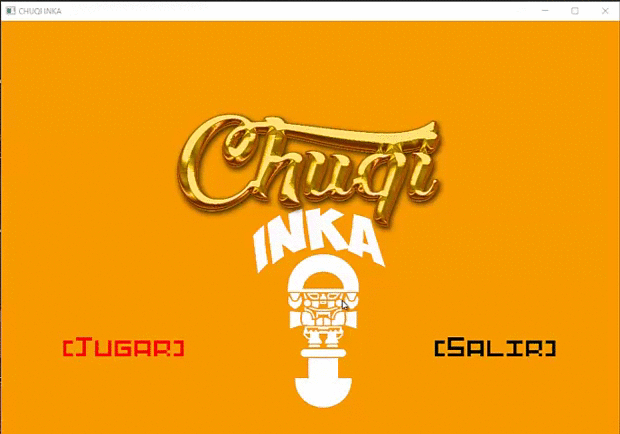

# CHUQI-INKA
_PROYECTO FINAL CC2 / Bejeweled Game Clone_<br/>
_Juego de combinar 3 o más gemas en una fila o columna. Este proyecto fue creado para practicar los temas realizados en el curso de Ciencias de la Computacion 2 (programacion orientada a objetos ) en C++ aprendiendo a utilizar una libreria grafica ,en este caso SMFL._

<p align="center">
  
</p>


## Descripción 📌
Los jugadores tienen que mover una joya para juntar tres o más joyas adyacentes del mismo color. Cuando esto ocurre, las joyas desaparecen y un nuevo grupo de gemas se generan aleatoriamente desde arriba para llenar el espacio vacío. A veces, se forman combinaciones automáticas, creando una cadena conocida como cascada. 
El juego termina cuando no hay mas movimientos posibles.

<p align="center">
  
</p>

# Pre-requisitos 📋

_Que cosas necesitas para instalar el software y como instalarlas_

```
Dev-C++ 
```
```
Simple and Fast Multimedia Library (SFML)
```

# Autores ✒️

* **Kemely Castillo**  - [kemely2018](https://github.com/kemely2018)

# Contribuciones
* FUENTES - [Dafont](https://www.dafont.com/es/)
* AUDIO - [Zapsplat](https://www.zapsplat.com/)
* Libreria - [SFML](https://www.sfml-dev.org/)
* TUTORIALES SFML(muy agradecida) - [Escuela de Juegos](https://www.youtube.com/watch?v=k89cqx0w3Cc&list=PL-EPeghw5sXg3t0egTspfHdUYMDqyOLwf) buscalo su canal esta super genial.
* C++(Vector/Algorithm) - [Cplusplus](http://www.cplusplus.com/)
* Invita una cerveza 🍺 a alguien del equipo. 
* Da las gracias públicamente 🤓.
* etc.
