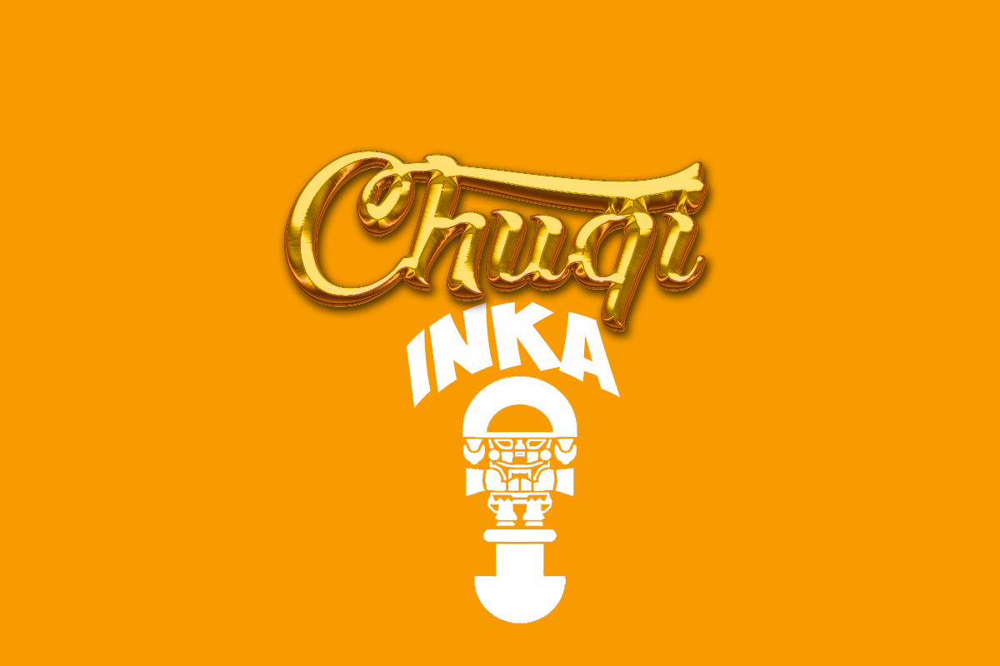

# CHUQI-INKA
_PROYECTO FINAL CC2 / Bejeweled Game Clone_ 
_Juego de combinar 3 o más gemas en una fila o columna. Este proyecto fue creado para practicar los temas realizados en el curso de Ciencias de la Computacion 2 (programacion orientada a objetos ) en C++ aprendiendo a utilizar una libreria grafica ,en este caso SMFL._

  

## Descripción 🗒
Los jugadores tienen que mover una joya para juntar tres o más joyas adyacentes del mismo color. Cuando esto ocurre, las joyas desaparecen y un nuevo grupo de gemas se generan aleatoriamente desde arriba para llenar el espacio vacío. A veces, se forman combinaciones automáticas, creando una cadena conocida como cascada. 
El juego termina cuando no hay mas movimientos posibles.
